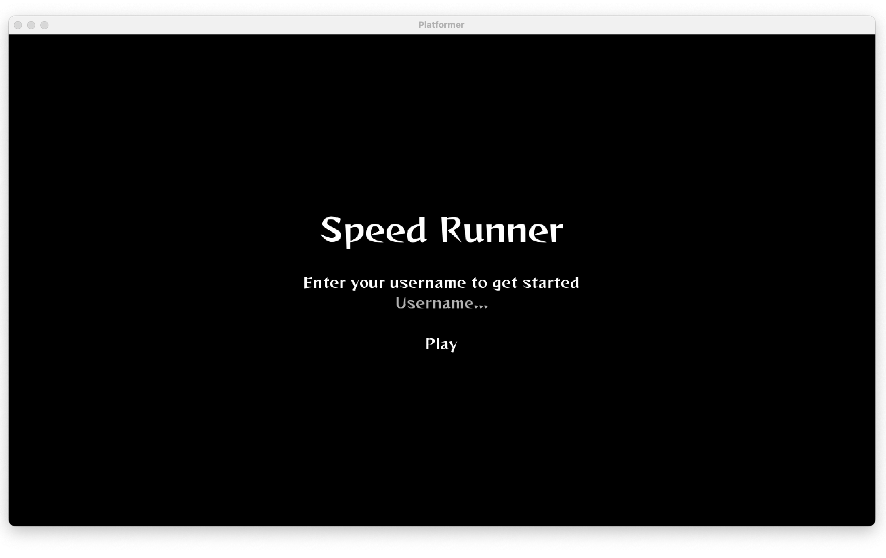

## Introduction

- Welcome to "Speed Runner", a fast-paced 2D platformer where your goal is to complete the level as quickly as possible without dying.
- Navigate through treacherous obstacles and avoid deadly enemies as you race towards the finish line.
- Speed Runner is easy to pick but difficult to master. So gear up, get ready to run, and see if you have what it takes to become the ultimate speed runner!

## Installation Guide

Speed Runner was developed using the Java programming languge and the LibGDX game development framework, which makes it very easy to install. You can simply download the game's .jar file and start playing immediately without the need for any additional setup or configurations

#### Step by Step guide 
1. Download the game from the provided link :- [Speed Runner](https://github.com/Siddgh/speedrunner/blob/main/speedrunner.jar)
2. Ensure Java is installed on your computer. If not, download and install java from the official Java website
   You can check if Java is installed or not by typing `java -version` in the terminal window
   ![[Pasted image 20230503105408.png | 400]]
3. Open the command prompt or terminal
   
   ![[Pasted image 20230503105515.png | 400]]
4. Use the "cd" command in the command prompt or terminal to navigate to the directory where the game was downloaded.
   For example, if the game was downloaded to the "Downloads" folder, type `cd Downloads` and press Enter
   
   ![[Pasted image 20230503105629.png | 400]]
   
   5. Run the game by typing `java -jar SpeedRunner.jar` in the command prompt or terminal and press enter.

```ad-note
Note: If you're using macOS, you can use the command "java -XstartOnFirstThread -jar speedrunner.jar"
```

6. This will launch the game and you can start playing!

## Getting Started

1. Once you've successfully launched the game, you'll be greeted with this Welcome Screen.


2. Enter your username and click play to start the game

#### Getting Familiar with the Game and its Characters

- In Speed Runner you play a guy named "Speed"
- Speed lives in a Ghost town and has to reach home as quick as possible.
- He has to avoid obstacles and all the demons that are in between his path

- Look out for Ghosts and Demons, make sure you don't touch them as you rush through the game. 
   


## Features and Functionality

The Game mechanics are simple to master. 

- As the main character, you can run both directions and jump
- You could use either the Arrow keys (Up Arrow is for Jump & Left or Right arrow is to run in either directions)
  
- If you're more comfortable using the keyboard ASDW keys, go ahead!
  
  
  - You can also use `Spacebar` to jump   


## User Interface

#### Game is easy to navigate with a Survival time count running when the player is active


#### Avoid ghosts on your way towards your goal


#### Look out for Fire-breathing dragons
  
  
  
#### Navigate through difficult obstacles
  
  

#### Compete for Highscores
  


## Frequently Asked Questions

#### Why is the Username required?
We use the username to store your highscore. When you enter a username, the game you play and the highscore you get is then store against your username in the database. 
So in cases where multiple people are competiting against eachother you can differentiaete each others highscore through your usernames. 

#### Is this Compatile with Windows?
Yes, Since the game is purely written in Java, its compatile with all devices that can run Java. 
The only prerequisite to running this game is that your local machine should have Java installed. 
